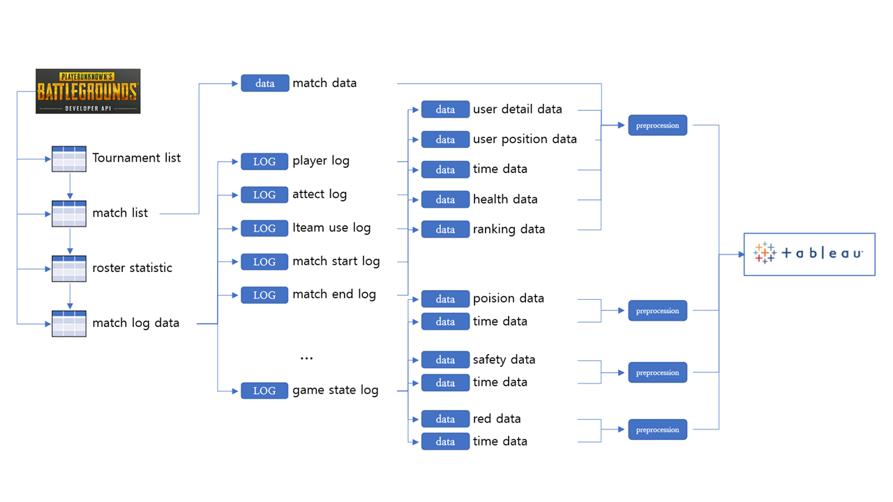
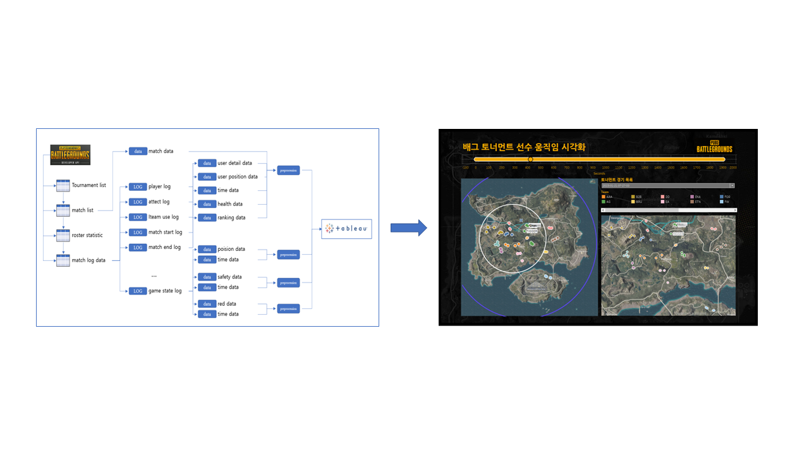

# 배그 로그 시각화

op.gg 에서 확인할 수 있는 킬 수, 입힌 데미지, 최고 사거리, 해드샷 수 등 기본적인 통계 데이터가 아닌
지도에서 어떻게 이동하고, 자기장 범위는 어떻고, 어디서 죽고 죽이는 시각화 데이터를 확인하고 싶어 시각화 프로젝트를 시작하게 되었다.

## Tableau Dashboard

- tableau gif
  - 마우스 호버로 원하는 경기 장면을 볼 수 있고
  - 20개의 경기 전환 가능(최대 500개 이상의 경기 가능, 데이터 용량 문제로 20개만 사용)

[태블로 퍼블릭](https://prod-apnortheast-a.online.tableau.com/t/jack2/views/_0/sheet7)

## 프로젝트 구조

- api 수집, 로그 분석, 전처리 구조도

## 파일 구조

- read_tournaments.py
  - 토너먼트 리스트 가져오기
    - 배그 토너먼트 경기 데이터를 져오기
- read_matchs.py
  - 매치 데이터 가져오기
    - 토너먼트별 여러 경기 데이터를 가져오고
    - 그 경기의 통계 데이터와 지도 데이터 가져오기
- make_visualization.py
  - 시각화 데이터 만들기
    - 한 경기당 유저들의 이동, 죽는 위치, 자기장 위치, 승리 팀 등의 내용을 시각화 하기위해 데이터 전처리.

## 이후 개발사항

- 대시보드 개발
  - 경기 지도만 보여주는 것이 아닌 그 당시 킬 로그, 특정 선수 통계, 지금까지 생존한 선수 등의 정보를 가지는 대시보드 개발

- 불법프로그램 사용 유저 판별 모델 개발
  - 좌표 데이터를 활용하여 핵 유저 판별모델 개발
  - 1만개 이사의 경기들을 분석
    - 특정 지점(A -> B) 사격 정확도, 승리 확률을 계산한 모델 개발
  - A 유저가 여러 게임을 진행하며 발생한 모든 사격 이벤트의 사격 정확도, 승리확률 로그 종합.
  - 사격에 불리하고, 이기기 힘든 지역에서 계속 이기는 유저들의 특징을 수집하여 핵 사용 을 판별하는 모델을 개발
